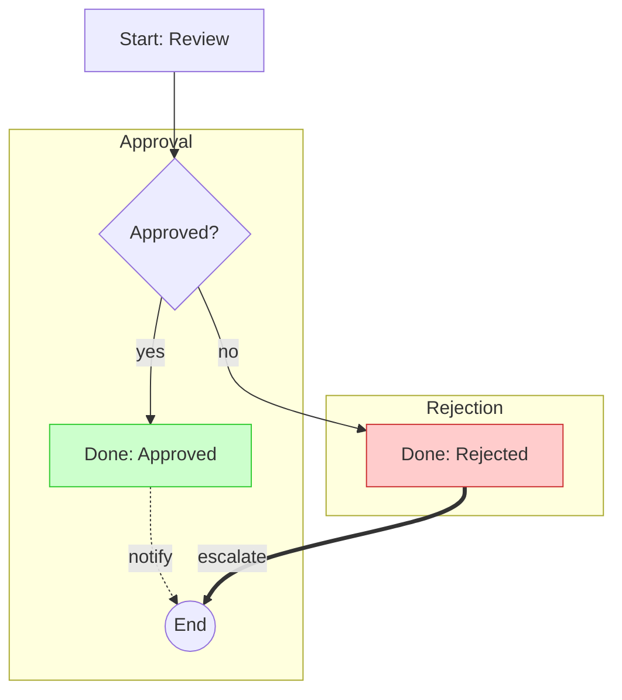

# Phase 2 — Rule Lowering 实现计划

> **面向 AI 代理的工作者：** 必需子技能：使用 superpowers:subagent-driven-development（推荐）或 superpowers:executing-plans 逐任务实现此计划。步骤使用复选框（`- [ ]`）语法来跟踪进度。

**目标：** 完整实现三个 rule lowering 子主题——决策树 DNF（AND/OR）、决策表行优先级+重叠检测、Mermaid subgraph 解构+多边类型+样式。

**架构：** 最小拓扑扩展——IR schema 加 `group`/`style`/`priority` 字段 + 3 个 `IREdgeKind` 变体；语义由图拓扑隐式编码（OR=分支、AND=链、优先级=边字段）。三个 lowering 模块独立实现，通过 `compile_to_ir.rs` 统一调度。

**技术栈：** Rust 2021、serde、insta（快照测试新增 dev-dependency）

**规格：** [docs/superpowers/specs/2026-07-13-phase2-rule-lowering-design.md](file:///e:/GitProjects/tangle/docs/superpowers/specs/2026-07-13-phase2-rule-lowering-design.md)

**工作区：** 从 `audit/v0.2.1` 分支创建 `phase2/v0.3.0`，worktree `.worktrees/phase2-v0.3.0`

---

## 文件结构

| 文件 | 职责 | 动作 |
|------|------|------|
| `compiler/tangle-cli/src/ir/graph.rs` | IR 数据结构 | 修改：加字段+enum 变体 |
| `compiler/tangle-cli/src/ir/lower_rule_tree.rs` | 决策树 lowering | 重写 |
| `compiler/tangle-cli/src/ir/lower_rule_table.rs` | 决策表 lowering | 修改：优先级+重叠检测 |
| `compiler/tangle-cli/src/ir/lower_rule_flow.rs` | Mermaid lowering | 修改：subgraph+多边+样式 |
| `compiler/tangle-cli/src/ir/compile_to_ir.rs` | IR 调度 | 修改：传递 diagnostics |
| `compiler/tangle-cli/src/ir/mod.rs` | IR 模块声明 | 不变 |
| `compiler/tangle-cli/Cargo.toml` | 依赖 | 修改：加 insta dev-dependency |
| `compiler/tangle-cli/tests/v03_phase2/` | Phase 2 测试 | 新建目录 |
| `tests/rules/decision-tree.tangle.md` | 决策树 fixture | 重写 |
| `tests/rules/decision-table-overlap.tangle.md` | 重叠表 fixture | 新建 |
| `tests/rules/approval-flow-subgraph.tangle.md` | Mermaid subgraph fixture | 新建 |

---

## 任务 1：IR Schema 变更

**文件：**
- 修改：`compiler/tangle-cli/src/ir/graph.rs`

- [ ] **步骤 1：编写失败的测试**

在 `graph.rs` 末尾的 `#[cfg(test)]` 模块中添加测试（若无 test 模块则新建）：

```rust
#[cfg(test)]
mod tests {
    use super::*;

    #[test]
    fn ir_node_has_group_and_style_fields() {
        let node = IRNode {
            id: "n0".into(),
            kind: IRNodeKind::Action,
            label: "test".into(),
            source_span: None,
            source_text: None,
            group: Some("Approval".into()),
            style: Some("className".into()),
        };
        assert_eq!(node.group.as_deref(), Some("Approval"));
        assert_eq!(node.style.as_deref(), Some("className"));
    }

    #[test]
    fn ir_edge_has_priority_and_style_fields() {
        let edge = IREdge {
            from: "n0".into(),
            to: "n1".into(),
            kind: IREdgeKind::Condition,
            guard: Some("x = 1".into()),
            source_span: None,
            priority: Some(0),
            style: Some("stroke:#ff3".into()),
        };
        assert_eq!(edge.priority, Some(0));
        assert_eq!(edge.style.as_deref(), Some("stroke:#ff3"));
    }

    #[test]
    fn ir_edge_kind_has_new_variants() {
        assert_eq!(IREdgeKind::Dashed, IREdgeKind::Dashed);
        assert_eq!(IREdgeKind::Thick, IREdgeKind::Thick);
        assert_eq!(IREdgeKind::Crossed, IREdgeKind::Crossed);
    }

    #[test]
    fn ir_node_serializes_new_fields() {
        let node = IRNode {
            id: "n0".into(),
            kind: IRNodeKind::Action,
            label: "test".into(),
            source_span: None,
            source_text: None,
            group: Some("G1".into()),
            style: None,
        };
        let json = serde_json::to_string(&node).unwrap();
        assert!(json.contains("\"group\":\"G1\""));
        assert!(!json.contains("\"style\""));
    }
}
```

- [ ] **步骤 2：运行测试验证失败**

运行：`cargo test -p tangle-cli --lib ir::graph::tests -- --nocapture`
预期：FAIL，报错 `no field group` / `no field style` / `no field priority` / `no variant Dashed`

- [ ] **步骤 3：修改 IRNode 添加 group 和 style 字段**

在 `graph.rs` 中修改 `IRNode` 结构体：

```rust
#[derive(Debug, Clone, PartialEq, Serialize, Deserialize)]
#[serde(rename_all = "camelCase")]
pub struct IRNode {
    pub id: String,
    pub kind: IRNodeKind,
    pub label: String,
    pub source_span: Option<SourceSpan>,
    #[serde(default)]
    pub source_text: Option<String>,
    #[serde(default, skip_serializing_if = "Option::is_none")]
    pub group: Option<String>,
    #[serde(default, skip_serializing_if = "Option::is_none")]
    pub style: Option<String>,
}
```

- [ ] **步骤 4：修改 IREdge 添加 priority 和 style 字段**

```rust
#[derive(Debug, Clone, PartialEq, Serialize, Deserialize)]
#[serde(rename_all = "camelCase")]
pub struct IREdge {
    pub from: String,
    pub to: String,
    pub kind: IREdgeKind,
    pub guard: Option<String>,
    pub source_span: Option<SourceSpan>,
    #[serde(default, skip_serializing_if = "Option::is_none")]
    pub priority: Option<u32>,
    #[serde(default, skip_serializing_if = "Option::is_none")]
    pub style: Option<String>,
}
```

- [ ] **步骤 5：修改 IREdgeKind 添加新变体**

```rust
#[derive(Debug, Clone, Copy, PartialEq, Eq, Serialize, Deserialize)]
#[serde(rename_all = "lowercase")]
pub enum IREdgeKind {
    Control,
    Condition,
    Error,
    Dashed,
    Thick,
    Crossed,
}
```

- [ ] **步骤 6：修复所有现有 IRNode/IREdge 构造点**

搜索所有 `IRNode {` 和 `IREdge {` 构造，添加 `group: None, style: None`（IRNode）和 `priority: None, style: None`（IREdge）。涉及文件：
- `src/ir/lower.rs`
- `src/ir/lower_rule_tree.rs`（将被重写，可临时添加）
- `src/ir/lower_rule_table.rs`（将被修改，可临时添加）
- `src/ir/lower_rule_flow.rs`（将被修改，可临时添加）
- `src/ir/lower_rule_toggle.rs`
- `src/ir/compile_to_ir.rs`

- [ ] **步骤 7：运行测试验证通过**

运行：`cargo test -p tangle-cli --lib ir::graph::tests -- --nocapture`
预期：PASS

- [ ] **步骤 8：运行全量测试确保无回归**

运行：`cargo test --workspace`
预期：所有现有测试 PASS

- [ ] **步骤 9：Commit**

```bash
git add compiler/tangle-cli/src/ir/graph.rs compiler/tangle-cli/src/ir/lower.rs compiler/tangle-cli/src/ir/lower_rule_tree.rs compiler/tangle-cli/src/ir/lower_rule_table.rs compiler/tangle-cli/src/ir/lower_rule_flow.rs compiler/tangle-cli/src/ir/lower_rule_toggle.rs compiler/tangle-cli/src/ir/compile_to_ir.rs
git commit -m "feat(ir): add group/style/priority fields and Dashed/Thick/Crossed edge kinds"
```

---

## 任务 2：添加 insta dev-dependency

**文件：**
- 修改：`compiler/tangle-cli/Cargo.toml`

- [ ] **步骤 1：添加 insta 到 dev-dependencies**

在 `Cargo.toml` 的 `[dev-dependencies]` 末尾添加：

```toml
insta = { version = "1", features = ["json"] }
```

- [ ] **步骤 2：验证依赖可用**

运行：`cargo check -p tangle-cli --tests`
预期：成功拉取 insta crate，无错误

- [ ] **步骤 3：Commit**

```bash
git add compiler/tangle-cli/Cargo.toml
git commit -m "build: add insta dev-dependency for snapshot testing"
```

---

## 任务 3：Tree Lowering — 缩进感知解析

**文件：**
- 修改：`compiler/tangle-cli/src/ir/lower_rule_tree.rs`
- 测试：`compiler/tangle-cli/src/ir/lower_rule_tree.rs`（内联 `#[cfg(test)]`）

- [ ] **步骤 1：编写失败的测试**

在 `lower_rule_tree.rs` 末尾添加 test 模块：

```rust
#[cfg(test)]
mod tests {
    use super::*;

    #[test]
    fn parse_list_tracks_depth() {
        let md = "\
* Branch A
    * Cond 1
    * Cond 2
* Branch B
    * Cond 3
";
        let roots = parse_list_to_tree(md);
        assert_eq!(roots.len(), 2);
        assert_eq!(roots[0].text, "Branch A");
        assert_eq!(roots[0].depth, 0);
        assert_eq!(roots[0].children.len(), 2);
        assert_eq!(roots[0].children[0].text, "Cond 1");
        assert_eq!(roots[0].children[0].depth, 1);
        assert_eq!(roots[1].text, "Branch B");
        assert_eq!(roots[1].children.len(), 1);
    }

    #[test]
    fn parse_list_ignores_non_list_lines() {
        let md = "\
Some intro text
* Item 1
More text
    * Item 2
";
        let roots = parse_list_to_tree(md);
        assert_eq!(roots.len(), 1);
        assert_eq!(roots[0].text, "Item 1");
        assert_eq!(roots[0].children.len(), 1);
    }

    #[test]
    fn parse_list_handles_tab_indent() {
        let md = "\
* Branch
\t* Tabbed child
";
        let roots = parse_list_to_tree(md);
        assert_eq!(roots.len(), 1);
        assert_eq!(roots[0].children.len(), 1);
        assert_eq!(roots[0].children[0].text, "Tabbed child");
    }
}
```

- [ ] **步骤 2：运行测试验证失败**

运行：`cargo test -p tangle-cli --lib ir::lower_rule_tree::tests -- --nocapture`
预期：FAIL，`parse_list_to_tree` 未定义

- [ ] **步骤 3：实现 parse_list_to_tree**

在 `lower_rule_tree.rs` 中替换现有内容，先添加解析结构和方法（保留旧的 `lower_rule_tree` 函数暂不动，后续任务重写）：

```rust
use crate::ir::graph::*;
use crate::model::{SourceSpan, TangleDiagnostic};

/// 缩进感知的列表树节点
#[derive(Debug, Clone)]
pub struct ListNode {
    pub text: String,
    pub depth: usize,
    pub children: Vec<ListNode>,
}

/// 解析嵌套列表为缩进感知的树结构。
/// 每 4 空格或 1 tab = 1 级深度。
pub fn parse_list_to_tree(markdown: &str) -> Vec<ListNode> {
    let mut items: Vec<(usize, String)> = vec![];
    for line in markdown.lines() {
        let trimmed = line.trim_start();
        if !trimmed.starts_with("* ") && !trimmed.starts_with("- ") {
            continue;
        }
        let indent = line.len() - trimmed.len();
        let depth = compute_depth(indent);
        let text = trimmed
            .trim_start_matches("* ")
            .trim_start_matches("- ")
            .trim()
            .to_string();
        items.push((depth, text));
    }
    build_tree(&items, 0, &mut 0)
}

fn compute_depth(indent: usize) -> usize {
    // 简化：4 空格 = 1 级，1 tab = 1 级，混合时按 4 空格折算
    // 逐字符扫描以正确处理 tab
    let mut depth = 0;
    let mut spaces = 0;
    for c in (0..indent).map(|i| line_char_at(indent, i)) {
        match c {
            '\t' => {
                depth += 1;
                spaces = 0;
            }
            ' ' => {
                spaces += 1;
                if spaces == 4 {
                    depth += 1;
                    spaces = 0;
                }
            }
            _ => break,
        }
    }
    depth
}

fn line_char_at(_indent: usize, _i: usize) -> char {
    // 占位——实际实现需访问原始行
    ' '
}
```

**注意：** `compute_depth` 需要访问原始行的缩进字符。修正实现——把 `parse_list_to_tree` 改为逐行处理缩进字符：

```rust
pub fn parse_list_to_tree(markdown: &str) -> Vec<ListNode> {
    let mut items: Vec<(usize, String)> = vec![];
    for line in markdown.lines() {
        let trimmed = line.trim_start();
        if !trimmed.starts_with("* ") && !trimmed.starts_with("- ") {
            continue;
        }
        let leading = &line[..line.len() - trimmed.len()];
        let depth = compute_depth_from_str(leading);
        let text = trimmed
            .trim_start_matches("* ")
            .trim_start_matches("- ")
            .trim()
            .to_string();
        items.push((depth, text));
    }
    let mut idx = 0;
    build_tree(&items, 0, &mut idx)
}

fn compute_depth_from_str(leading: &str) -> usize {
    let mut depth = 0;
    let mut spaces = 0;
    for c in leading.chars() {
        match c {
            '\t' => { depth += 1; spaces = 0; }
            ' ' => {
                spaces += 1;
                if spaces == 4 { depth += 1; spaces = 0; }
            }
            _ => break,
        }
    }
    depth
}

fn build_tree(items: &[(usize, String)], target_depth: usize, idx: &mut usize) -> Vec<ListNode> {
    let mut nodes = vec![];
    while *idx < items.len() {
        let (depth, ref text) = items[*idx];
        if depth < target_depth {
            break;
        }
        if depth == target_depth {
            *idx += 1;
            let children = build_tree(items, target_depth + 1, idx);
            nodes.push(ListNode {
                text: text.clone(),
                depth: target_depth,
                children,
            });
        } else {
            // depth > target_depth：不应发生（由上层 build_tree 处理），跳过
            *idx += 1;
        }
    }
    nodes
}
```

保留旧的 `lower_rule_tree` 函数不变（下个任务重写）。

- [ ] **步骤 4：运行测试验证通过**

运行：`cargo test -p tangle-cli --lib ir::lower_rule_tree::tests -- --nocapture`
预期：3 个测试 PASS

- [ ] **步骤 5：Commit**

```bash
git add compiler/tangle-cli/src/ir/lower_rule_tree.rs
git commit -m "feat(ir): add indentation-aware list parser for rule tree lowering"
```

---

## 任务 4：Tree Lowering — DNF 到 IR 拓扑

**文件：**
- 修改：`compiler/tangle-cli/src/ir/lower_rule_tree.rs`

- [ ] **步骤 1：编写失败的测试**

在 `lower_rule_tree.rs` 的 test 模块中添加：

```rust
#[test]
fn lower_tree_dnf_basic() {
    let md = "\
* Branch A
    * Income: high
    * Credit: good
    * Action: approve
* Branch B
    * Income: low
    * Action: reject
";
    let mut id_gen = FreshNodeId::new();
    let (graph, diags) = lower_rule_tree(md, "test.md", &mut id_gen);

    // entry + 2 branches × (1 cond + 1 action) = 1 + 2×2 = 5 nodes
    assert_eq!(graph.nodes.len(), 5);
    // entry → branch1_cond (1) + entry → branch2_cond (1) + cond1→action1 (1) + cond2→action2 (1) = 4 edges
    // 但 Branch B 有 1 cond + 1 action = 2 nodes, Branch A 有 2 conds + 1 action
    // 重新计算：entry + [Income:high, Credit:good, Action:approve] + [Income:low, Action:reject]
    // = 1 + 3 + 2 = 6 nodes
    assert_eq!(graph.nodes.len(), 6);
    // edges: entry→Income:high, Income:high→Credit:good, Credit:good→Action:approve
    //        entry→Income:low, Income:low→Action:reject = 5 edges
    assert_eq!(graph.edges.len(), 5);
    assert!(diags.is_empty());
}

#[test]
fn lower_tree_no_action_warns() {
    let md = "\
* Branch A
    * Income: high
";
    let mut id_gen = FreshNodeId::new();
    let (_graph, diags) = lower_rule_tree(md, "test.md", &mut id_gen);
    assert!(diags.iter().any(|d| d.code == "TANGLE_RULE_NO_ACTION"));
}

#[test]
fn lower_tree_empty_branch_warns() {
    let md = "* Branch A\n";
    let mut id_gen = FreshNodeId::new();
    let (_graph, diags) = lower_rule_tree(md, "test.md", &mut id_gen);
    assert!(diags.iter().any(|d| d.code == "TANGLE_RULE_EMPTY_BRANCH"));
}

#[test]
fn lower_tree_action_node_kind() {
    let md = "\
* Branch A
    * Action: approve
";
    let mut id_gen = FreshNodeId::new();
    let (graph, _diags) = lower_rule_tree(md, "test.md", &mut id_gen);
    let action_node = graph.nodes.iter().find(|n| n.label == "approve").unwrap();
    assert_eq!(action_node.kind, IRNodeKind::Action);
}
```

- [ ] **步骤 2：运行测试验证失败**

运行：`cargo test -p tangle-cli --lib ir::lower_rule_tree::tests -- --nocapture`
预期：FAIL，`lower_rule_tree` 返回值不匹配（当前返回 `RuleGraph`，测试期望 `(RuleGraph, Vec<TangleDiagnostic>)`）

- [ ] **步骤 3：重写 lower_rule_tree 函数**

替换 `lower_rule_tree.rs` 中的 `lower_rule_tree` 函数（保留 `parse_list_to_tree` 等辅助函数）：

```rust
pub fn lower_rule_tree(
    list_markdown: &str,
    _file: &str,
    id_gen: &mut FreshNodeId,
) -> (RuleGraph, Vec<TangleDiagnostic>) {
    let mut diagnostics = vec![];
    let entry_id = id_gen.fresh();
    let mut graph = create_graph(entry_id.clone());

    graph.nodes.push(IRNode {
        id: entry_id.clone(),
        kind: IRNodeKind::Decision,
        label: "tree.entry".into(),
        source_span: None,
        source_text: None,
        group: None,
        style: None,
    });

    let roots = parse_list_to_tree(list_markdown);

    for branch in &roots {
        if branch.children.is_empty() {
            diagnostics.push(TangleDiagnostic {
                code: "TANGLE_RULE_EMPTY_BRANCH".into(),
                message: format!("branch '{}' has no conditions or action", branch.text),
                span: SourceSpan { file: _file.into(), start_line: 0, start_column: 0, end_line: 0, end_column: 0 },
            });
            continue;
        }

        let has_action = branch.children.iter().any(|c| c.text.starts_with("Action:"));
        if !has_action {
            diagnostics.push(TangleDiagnostic {
                code: "TANGLE_RULE_NO_ACTION".into(),
                message: format!("branch '{}' has no Action: marker", branch.text),
                span: SourceSpan { file: _file.into(), start_line: 0, start_column: 0, end_line: 0, end_column: 0 },
            });
        }

        let conditions: Vec<&ListNode> = branch.children.iter()
            .filter(|c| !c.text.starts_with("Action:"))
            .collect();

        let first_cond_id = if conditions.is_empty() {
            None
        } else {
            let cond = conditions[0];
            let node_id = id_gen.fresh();
            graph.nodes.push(IRNode {
                id: node_id.clone(),
                kind: IRNodeKind::Decision,
                label: cond.text.clone(),
                source_span: None,
                source_text: None,
                group: None,
                style: None,
            });
            graph.edges.push(IREdge {
                from: entry_id.clone(),
                to: node_id.clone(),
                kind: IREdgeKind::Condition,
                guard: Some(cond.text.clone()),
                source_span: None,
                priority: None,
                style: None,
            });
            Some(node_id)
        };

        let mut prev_id = first_cond_id;
        for cond in conditions.iter().skip(1) {
            let node_id = id_gen.fresh();
            graph.nodes.push(IRNode {
                id: node_id.clone(),
                kind: IRNodeKind::Decision,
                label: cond.text.clone(),
                source_span: None,
                source_text: None,
                group: None,
                style: None,
            });
            let from = prev_id.clone().unwrap_or_else(|| entry_id.clone());
            graph.edges.push(IREdge {
                from,
                to: node_id.clone(),
                kind: IREdgeKind::Condition,
                guard: Some(cond.text.clone()),
                source_span: None,
                priority: None,
                style: None,
            });
            prev_id = Some(node_id);
        }

        // Action node at end of branch
        for child in &branch.children {
            if let Some(action_label) = child.text.strip_prefix("Action:") {
                let action_id = id_gen.fresh();
                graph.nodes.push(IRNode {
                    id: action_id.clone(),
                    kind: IRNodeKind::Action,
                    label: action_label.trim().to_string(),
                    source_span: None,
                    source_text: None,
                    group: None,
                    style: None,
                });
                let from = prev_id.clone().unwrap_or_else(|| entry_id.clone());
                graph.edges.push(IREdge {
                    from,
                    to: action_id,
                    kind: IREdgeKind::Control,
                    guard: None,
                    source_span: None,
                    priority: None,
                    style: None,
                });
            }
        }
    }

    (graph, diagnostics)
}
```

- [ ] **步骤 4：更新 compile_to_ir.rs 以接收 diagnostics**

在 `compile_to_ir.rs` 的 `collect_rule_graphs` 中，修改 `lower_rule_tree` 调用以接收 diagnostics。修改函数签名和调用点：

```rust
fn collect_rule_graphs(
    headings: &[TangleHeading],
    file: &str,
    id_gen: &mut FreshNodeId,
    out: &mut Vec<RuleGraph>,
    diagnostics: &mut Vec<TangleDiagnostic>,
) {
    for h in headings {
        if let Some(ref rule) = h.rule {
            let (sub_graph, rule_diags) = match rule.kind {
                RuleKind::Flow => {
                    // lower_rule_flow 暂未返回 diagnostics，用空 vec
                    (lower_rule_flow(&rule.source, file, id_gen), vec![])
                }
                RuleKind::Table => {
                    (lower_rule_table(&rule.source, file, id_gen), vec![])
                }
                RuleKind::Tree => lower_rule_tree(&rule.source, file, id_gen),
                RuleKind::Toggle => {
                    (lower_rule_toggle(&rule.source, file, id_gen), vec![])
                }
            };
            out.push(sub_graph);
            diagnostics.extend(rule_diags);
        }
        collect_rule_graphs(&h.children, file, id_gen, out, diagnostics);
    }
}
```

在 `compile_to_ir` 函数中更新调用：

```rust
let mut rule_graphs: Vec<RuleGraph> = vec![];
collect_rule_graphs(&checked.headings, &checked.file, &mut id_gen, &mut rule_graphs, &mut diagnostics);
```

- [ ] **步骤 5：运行测试验证通过**

运行：`cargo test -p tangle-cli --lib ir::lower_rule_tree::tests -- --nocapture`
预期：所有 tree 测试 PASS

- [ ] **步骤 6：运行全量测试确保无回归**

运行：`cargo test --workspace`
预期：所有测试 PASS

- [ ] **步骤 7：Commit**

```bash
git add compiler/tangle-cli/src/ir/lower_rule_tree.rs compiler/tangle-cli/src/ir/compile_to_ir.rs
git commit -m "feat(ir): rewrite rule tree lowering with DNF semantics and Action: marker"
```

---

## 任务 5：Tree Fixture 重写

**文件：**
- 修改：`tests/rules/decision-tree.tangle.md`

- [ ] **步骤 1：重写 fixture**

将 `tests/rules/decision-tree.tangle.md` 的规则部分替换为 DNF 格式：

```markdown
# Decision Tree

决策树示例：信用审批的 DNF（析取范式）规则。

## Rule: DecisionTree

* Approve path
    * Income check: true
    * Credit check: true
    * Collateral: true
    * Action: approve
* Reject path
    * Action: reject
```

- [ ] **步骤 2：运行审计确保无回归**

运行：`pwsh tests/audit/run-audit.ps1`
预期：0 failing cells（fixture 重写后审计仍通过）

- [ ] **步骤 3：Commit**

```bash
git add tests/rules/decision-tree.tangle.md
git commit -m "test(rules): rewrite decision-tree fixture for DNF model with Action: marker"
```

---

## 任务 6：Table Lowering — 优先级编码

**文件：**
- 修改：`compiler/tangle-cli/src/ir/lower_rule_table.rs`

- [ ] **步骤 1：编写失败的测试**

在 `lower_rule_table.rs` 末尾添加 test 模块：

```rust
#[cfg(test)]
mod tests {
    use super::*;

    #[test]
    fn table_assigns_priority_by_row_order() {
        let md = "\
| Income | Credit | Result |
|--------|--------|--------|
| high | good | approve |
| low | - | review |
| - | poor | reject |
";
        let mut id_gen = FreshNodeId::new();
        let graph = lower_rule_table(md, "test.md", &mut id_gen);

        // 3 data rows → 3 edges from entry, each with priority
        let entry_edges: Vec<&IREdge> = graph.edges.iter()
            .filter(|e| e.from == graph.entry_node_id)
            .collect();
        assert_eq!(entry_edges.len(), 3);
        assert_eq!(entry_edges[0].priority, Some(0));
        assert_eq!(entry_edges[1].priority, Some(1));
        assert_eq!(entry_edges[2].priority, Some(2));
    }

    #[test]
    fn table_wildcard_omits_condition() {
        let md = "\
| Income | Result |
|--------|--------|
| - | approve |
";
        let mut id_gen = FreshNodeId::new();
        let graph = lower_rule_table(md, "test.md", &mut id_gen);
        let edge = &graph.edges[0];
        assert!(edge.guard.is_none()); // wildcard → no guard
    }
}
```

- [ ] **步骤 2：运行测试验证失败**

运行：`cargo test -p tangle-cli --lib ir::lower_rule_table::tests -- --nocapture`
预期：FAIL，`priority` 字段为 `None`（当前未赋值）

- [ ] **步骤 3：修改 lower_rule_table 添加 priority**

在 `lower_rule_table.rs` 中，修改数据行循环，添加行索引和 priority：

```rust
pub fn lower_rule_table(table_markdown: &str, _file: &str, id_gen: &mut FreshNodeId) -> RuleGraph {
    let entry_id = id_gen.fresh();
    let mut graph = create_graph(entry_id.clone());

    graph.nodes.push(IRNode {
        id: entry_id.clone(),
        kind: IRNodeKind::Decision,
        label: "table.entry".into(),
        source_span: None, source_text: None,
        group: None, style: None,
    });

    let lines: Vec<&str> = table_markdown
        .lines()
        .filter(|l| l.contains('|'))
        .filter(|l| {
            !l.trim()
                .chars()
                .all(|c| c == '|' || c == '-' || c == ':' || c == ' ')
        })
        .collect();

    if lines.len() < 2 {
        return graph;
    }

    let headers: Vec<String> = split_table_row(lines[0]);
    if headers.is_empty() {
        return graph;
    }

    let condition_count = headers.len().saturating_sub(1);

    for (row_idx, line) in lines[1..].iter().enumerate() {
        let cells = split_table_row(line);
        if cells.len() < 2 {
            continue;
        }

        let action = cells.last().unwrap().clone();
        let mut conditions = vec![];

        for (i, cell) in cells
            .iter()
            .enumerate()
            .take(condition_count.min(cells.len().saturating_sub(1)))
        {
            let cond_val = cell.trim().to_string();
            if !cond_val.is_empty() && cond_val != "-" {
                let col_name = headers.get(i).map(|h| h.trim()).unwrap_or("?");
                conditions.push(format!("{} = {}", col_name, cond_val));
            }
        }

        let node_id = id_gen.fresh();
        let guard = if conditions.is_empty() {
            None
        } else {
            Some(conditions.join(" AND "))
        };

        graph.nodes.push(IRNode {
            id: node_id.clone(),
            kind: IRNodeKind::Action,
            label: action,
            source_span: None, source_text: None,
            group: None, style: None,
        });
        graph.edges.push(IREdge {
            from: entry_id.clone(),
            to: node_id,
            kind: IREdgeKind::Condition,
            guard,
            source_span: None,
            priority: Some(row_idx as u32),
            style: None,
        });
    }

    graph
}
```

- [ ] **步骤 4：运行测试验证通过**

运行：`cargo test -p tangle-cli --lib ir::lower_rule_table::tests -- --nocapture`
预期：2 个测试 PASS

- [ ] **步骤 5：Commit**

```bash
git add compiler/tangle-cli/src/ir/lower_rule_table.rs
git commit -m "feat(ir): encode table row priority in IREdge.priority field"
```

---

## 任务 7：Table Lowering — 重叠检测

**文件：**
- 修改：`compiler/tangle-cli/src/ir/lower_rule_table.rs`
- 修改：`compiler/tangle-cli/src/ir/compile_to_ir.rs`

- [ ] **步骤 1：编写失败的测试**

在 `lower_rule_table.rs` 的 test 模块中添加：

```rust
#[test]
fn rows_overlap_detects_wildcard_intersection() {
    assert!(rows_overlap(&["high".into(), "-".into()], &["high".into(), "good".into()]));
    assert!(rows_overlap(&["-".into(), "-".into()], &["low".into(), "bad".into()]));
    assert!(!rows_overlap(&["high".into(), "good".into()], &["low".into(), "good".into()]));
}

#[test]
fn table_overlap_emits_warning() {
    let md = "\
| Income | Credit | Result |
|--------|--------|--------|
| high | - | approve |
| - | good | review |
";
    let mut id_gen = FreshNodeId::new();
    let (_graph, diags) = lower_rule_table_with_diagnostics(md, "test.md", &mut id_gen);
    assert!(diags.iter().any(|d| d.code == "TANGLE_RULE_OVERLAP"));
}

#[test]
fn table_no_overlap_no_warning() {
    let md = "\
| Income | Credit | Result |
|--------|--------|--------|
| high | good | approve |
| low | poor | reject |
";
    let mut id_gen = FreshNodeId::new();
    let (_graph, diags) = lower_rule_table_with_diagnostics(md, "test.md", &mut id_gen);
    assert!(!diags.iter().any(|d| d.code == "TANGLE_RULE_OVERLAP"));
}

#[test]
fn table_unreachable_emits_info() {
    let md = "\
| Income | Credit | Result |
|--------|--------|--------|
| - | - | approve |
| high | good | reject |
";
    let mut id_gen = FreshNodeId::new();
    let (_graph, diags) = lower_rule_table_with_diagnostics(md, "test.md", &mut id_gen);
    assert!(diags.iter().any(|d| d.code == "TANGLE_RULE_UNREACHABLE"));
}
```

- [ ] **步骤 2：运行测试验证失败**

运行：`cargo test -p tangle-cli --lib ir::lower_rule_table::tests -- --nocapture`
预期：FAIL，`rows_overlap` 和 `lower_rule_table_with_diagnostics` 未定义

- [ ] **步骤 3：实现 rows_overlap 和重命名 lower_rule_table**

在 `lower_rule_table.rs` 中，将 `lower_rule_table` 重命名为 `lower_rule_table_with_diagnostics` 并返回 `(RuleGraph, Vec<TangleDiagnostic>)`。添加 `lower_rule_table` 包装器保持向后兼容。添加 `rows_overlap`：

```rust
use crate::model::{SourceSpan, TangleDiagnostic};

/// 检测两行条件是否重叠（都能匹配同一输入）。`-` = 通配。
pub fn rows_overlap(row_a: &[String], row_b: &[String]) -> bool {
    row_a.iter().zip(row_b.iter())
        .all(|(a, b)| a == "-" || b == "-" || a == b)
}

pub fn lower_rule_table_with_diagnostics(
    table_markdown: &str,
    _file: &str,
    id_gen: &mut FreshNodeId,
) -> (RuleGraph, Vec<TangleDiagnostic>) {
    let mut diagnostics = vec![];
    let entry_id = id_gen.fresh();
    let mut graph = create_graph(entry_id.clone());

    graph.nodes.push(IRNode {
        id: entry_id.clone(),
        kind: IRNodeKind::Decision,
        label: "table.entry".into(),
        source_span: None, source_text: None,
        group: None, style: None,
    });

    let lines: Vec<&str> = table_markdown
        .lines()
        .filter(|l| l.contains('|'))
        .filter(|l| {
            !l.trim().chars().all(|c| c == '|' || c == '-' || c == ':' || c == ' ')
        })
        .collect();

    if lines.len() < 2 {
        return (graph, diagnostics);
    }

    let headers: Vec<String> = split_table_row(lines[0]);
    if headers.is_empty() {
        return (graph, diagnostics);
    }

    let condition_count = headers.len().saturating_sub(1);

    // 解析所有数据行为条件值数组（用于重叠检测）
    let mut parsed_rows: Vec<Vec<String>> = vec![];
    let mut parsed_actions: Vec<String> = vec![];
    for line in &lines[1..] {
        let cells = split_table_row(line);
        if cells.len() < 2 {
            continue;
        }
        let conds: Vec<String> = cells.iter()
            .take(condition_count.min(cells.len().saturating_sub(1)))
            .map(|c| c.trim().to_string())
            .collect();
        parsed_rows.push(conds);
        parsed_actions.push(cells.last().unwrap().clone());
    }

    // 重叠检测：对每对行 (i, j) 且 i < j
    for i in 0..parsed_rows.len() {
        for j in (i + 1)..parsed_rows.len() {
            if rows_overlap(&parsed_rows[i], &parsed_rows[j]) {
                // 检查是否完全相同（duplicate）
                if parsed_rows[i] == parsed_rows[j] {
                    diagnostics.push(TangleDiagnostic {
                        code: "TANGLE_RULE_DUPLICATE".into(),
                        message: format!("rows {} and {} are identical", i + 1, j + 1),
                        span: SourceSpan { file: _file.into(), start_line: 0, start_column: 0, end_line: 0, end_column: 0 },
                    });
                } else {
                    // 检查行 i 是否完全覆盖行 j（j 不可达）
                    let i_covers_j = parsed_rows[i].iter().zip(parsed_rows[j].iter())
                        .all(|(a, b)| a == "-" || a == b);
                    if i_covers_j {
                        diagnostics.push(TangleDiagnostic {
                            code: "TANGLE_RULE_UNREACHABLE".into(),
                            message: format!("row {} is unreachable (covered by row {})", j + 1, i + 1),
                            span: SourceSpan { file: _file.into(), start_line: 0, start_column: 0, end_line: 0, end_column: 0 },
                        });
                    } else {
                        diagnostics.push(TangleDiagnostic {
                            code: "TANGLE_RULE_OVERLAP".into(),
                            message: format!("rows {} and {} overlap; row {} wins by priority", i + 1, j + 1, i + 1),
                            span: SourceSpan { file: _file.into(), start_line: 0, start_column: 0, end_line: 0, end_column: 0 },
                        });
                    }
                }
            }
        }
    }

    // 生成 IR 节点和边
    for (row_idx, conds) in parsed_rows.iter().enumerate() {
        let action = &parsed_actions[row_idx];
        let mut conditions = vec![];
        for (i, cond_val) in conds.iter().enumerate() {
            if !cond_val.is_empty() && cond_val != "-" {
                let col_name = headers.get(i).map(|h| h.trim()).unwrap_or("?");
                conditions.push(format!("{} = {}", col_name, cond_val));
            }
        }

        let node_id = id_gen.fresh();
        let guard = if conditions.is_empty() {
            None
        } else {
            Some(conditions.join(" AND "))
        };

        graph.nodes.push(IRNode {
            id: node_id.clone(),
            kind: IRNodeKind::Action,
            label: action.clone(),
            source_span: None, source_text: None,
            group: None, style: None,
        });
        graph.edges.push(IREdge {
            from: entry_id.clone(),
            to: node_id,
            kind: IREdgeKind::Condition,
            guard,
            source_span: None,
            priority: Some(row_idx as u32),
            style: None,
        });
    }

    (graph, diagnostics)
}

/// 向后兼容包装器（无 diagnostics）
pub fn lower_rule_table(table_markdown: &str, file: &str, id_gen: &mut FreshNodeId) -> RuleGraph {
    lower_rule_table_with_diagnostics(table_markdown, file, id_gen).0
}
```

- [ ] **步骤 4：更新 compile_to_ir.rs 调用带 diagnostics 的版本**

在 `collect_rule_graphs` 中修改 Table 分支：

```rust
RuleKind::Table => lower_rule_table_with_diagnostics(&rule.source, file, id_gen),
```

- [ ] **步骤 5：运行测试验证通过**

运行：`cargo test -p tangle-cli --lib ir::lower_rule_table::tests -- --nocapture`
预期：所有 table 测试 PASS

- [ ] **步骤 6：运行全量测试确保无回归**

运行：`cargo test --workspace`
预期：PASS

- [ ] **步骤 7：Commit**

```bash
git add compiler/tangle-cli/src/ir/lower_rule_table.rs compiler/tangle-cli/src/ir/compile_to_ir.rs
git commit -m "feat(ir): add table row overlap detection with TANGLE_RULE_OVERLAP/UNREACHABLE/DUPLICATE diagnostics"
```

---

## 任务 8：Table Overlap Fixture

**文件：**
- 创建：`tests/rules/decision-table-overlap.tangle.md`

- [ ] **步骤 1：创建 fixture**

```markdown
# Decision Table Overlap

决策表示例：含通配符和行重叠，验证 TANGLE_RULE_OVERLAP 诊断。

## Rule: DecisionTableOverlap

| Income | Credit | Result |
|--------|--------|--------|
| high | - | approve |
| - | good | review |
| high | good | conflict |
| - | - | default |
```

- [ ] **步骤 2：Commit**

```bash
git add tests/rules/decision-table-overlap.tangle.md
git commit -m "test(rules): add decision-table-overlap fixture for overlap detection"
```

---

## 任务 9：Mermaid Lowering — Subgraph 解析

**文件：**
- 修改：`compiler/tangle-cli/src/ir/lower_rule_flow.rs`

- [ ] **步骤 1：编写失败的测试**

在 `lower_rule_flow.rs` 末尾添加 test 模块：

```rust
#[cfg(test)]
mod tests {
    use super::*;

    #[test]
    fn flow_subgraph_assigns_group() {
        let md = "\
graph TD
    A[Start] --> B{Decision}
    subgraph Approval
        B -->|yes| C[Approve]
    end
    subgraph Rejection
        B -->|no| E[Reject]
    end
";
        let mut id_gen = FreshNodeId::new();
        let graph = lower_rule_flow(md, "test.md", &mut id_gen);

        let node_c = graph.nodes.iter().find(|n| n.label == "Approve").unwrap();
        assert_eq!(node_c.group.as_deref(), Some("Approval"));
        let node_e = graph.nodes.iter().find(|n| n.label == "Reject").unwrap();
        assert_eq!(node_e.group.as_deref(), Some("Rejection"));
        let node_a = graph.nodes.iter().find(|n| n.label == "Start").unwrap();
        assert!(node_a.group.is_none());
    }

    #[test]
    fn flow_no_subgraph_group_none() {
        let md = "\
graph TD
    A[Start] --> B[End]
";
        let mut id_gen = FreshNodeId::new();
        let graph = lower_rule_flow(md, "test.md", &mut id_gen);
        for node in &graph.nodes {
            assert!(node.group.is_none());
        }
    }
}
```

- [ ] **步骤 2：运行测试验证失败**

运行：`cargo test -p tangle-cli --lib ir::lower_rule_flow::tests -- --nocapture`
预期：FAIL，subgraph 未被解析，`group` 为 `None`

- [ ] **步骤 3：实现 subgraph 栈追踪**

修改 `lower_rule_flow` 函数，添加 subgraph 栈。在节点注册时填充 `group` 字段。修改 `register_node` 签名添加 `group` 参数：

```rust
pub fn lower_rule_flow(mermaid_source: &str, _file: &str, id_gen: &mut FreshNodeId) -> RuleGraph {
    let mut node_map: HashMap<String, String> = HashMap::new();
    let mut nodes: Vec<IRNode> = vec![];
    let mut edges: Vec<IREdge> = vec![];
    let mut entry_id: Option<String> = None;
    let mut subgraph_stack: Vec<String> = vec![];
    let mut edge_styles: HashMap<usize, String> = HashMap::new(); // edge_idx → style
    let mut node_styles: HashMap<String, String> = HashMap::new(); // mermaid_id → style
    let mut class_defs: HashMap<String, String> = HashMap::new();
    let mut class_assignments: HashMap<String, String> = HashMap::new(); // mermaid_id → class_name

    for line in mermaid_source.lines() {
        let line = line.trim();
        if line.is_empty()
            || line.starts_with("graph ")
            || line.starts_with("graph\t")
            || line.starts_with("```")
        {
            continue;
        }

        // 跳过注释
        if line.starts_with("%%") {
            continue;
        }

        // subgraph 开始
        if line.starts_with("subgraph ") {
            let name = line.trim_start_matches("subgraph ").trim().split_whitespace().next().unwrap_or("").to_string();
            subgraph_stack.push(name);
            continue;
        }

        // subgraph 结束
        if line == "end" {
            subgraph_stack.pop();
            continue;
        }

        // classDef
        if line.starts_with("classDef ") {
            let rest = line.trim_start_matches("classDef ");
            if let Some(sp) = rest.find(char::is_whitespace) {
                let class_name = rest[..sp].to_string();
                let style_def = rest[sp..].trim().to_string();
                class_defs.insert(class_name, style_def);
            }
            continue;
        }

        // class assignment: class A className
        if line.starts_with("class ") {
            let rest = line.trim_start_matches("class ");
            if let Some(sp) = rest.find(char::is_whitespace) {
                let node_ids = rest[..sp].split(',').map(|s| s.trim().to_string());
                let class_name = rest[sp..].trim().to_string();
                for nid in node_ids {
                    class_assignments.insert(nid, class_name.clone());
                }
            }
            continue;
        }

        // style A fill:#f9f
        if line.starts_with("style ") {
            let rest = line.trim_start_matches("style ");
            if let Some(sp) = rest.find(char::is_whitespace) {
                let node_id = rest[..sp].to_string();
                let style_def = rest[sp..].trim().to_string();
                node_styles.insert(node_id, style_def);
            }
            continue;
        }

        // linkStyle 0 stroke:#ff3
        if line.starts_with("linkStyle ") {
            // 延迟到边创建后处理，记录到 edge_styles
            // 先记录，稍后应用
            let rest = line.trim_start_matches("linkStyle ");
            if let Some(sp) = rest.find(char::is_whitespace) {
                let idx: usize = rest[..sp].parse().unwrap_or(0);
                let style_def = rest[sp..].trim().to_string();
                edge_styles.insert(idx, style_def);
            }
            continue;
        }

        let current_group = subgraph_stack.last().cloned();

        // Try standalone node declaration
        if let Some(caps) = parse_node_decl(line) {
            let (mermaid_id, label, is_error) = caps;
            register_node(&mermaid_id, label, is_error, current_group,
                &mut node_map, &mut nodes, &mut entry_id, id_gen);
            continue;
        }

        // Try edge
        if let Some((from_part, guard, to_part, edge_kind)) = parse_edge_parts_v2(line) {
            if let Some((from_id, from_label)) = extract_inline_node(&from_part) {
                let group = subgraph_stack.last().cloned();
                register_node(&from_id, from_label, false, group,
                    &mut node_map, &mut nodes, &mut entry_id, id_gen);
            }
            if let Some((to_id, to_label)) = extract_inline_node(&to_part) {
                let is_error = to_label.to_lowercase().starts_with("error:")
                    || to_label.starts_with("错误:");
                let group = subgraph_stack.last().cloned();
                register_node(&to_id, to_label, is_error, group,
                    &mut node_map, &mut nodes, &mut entry_id, id_gen);
            }

            let from_id = extract_node_id(&from_part);
            let to_id = extract_node_id(&to_part);

            if let (Some(from), Some(to)) = (node_map.get(&from_id), node_map.get(&to_id)) {
                let kind = if guard.is_some() {
                    IREdgeKind::Condition
                } else {
                    edge_kind
                };
                edges.push(IREdge {
                    from: from.clone(),
                    to: to.clone(),
                    kind,
                    guard,
                    source_span: None,
                    priority: None,
                    style: None,
                });
            }
        }
    }

    // 应用 node styles
    for (mermaid_id, style) in &node_styles {
        if let Some(ir_id) = node_map.get(mermaid_id) {
            if let Some(node) = nodes.iter_mut().find(|n| &n.id == ir_id) {
                node.style = Some(style.clone());
            }
        }
    }
    // 应用 class assignments
    for (mermaid_id, class_name) in &class_assignments {
        if let Some(ir_id) = node_map.get(mermaid_id) {
            if let Some(node) = nodes.iter_mut().find(|n| &n.id == ir_id) {
                node.style = Some(class_name.clone());
            }
        }
    }
    // 应用 edge styles (by index)
    for (idx, style) in &edge_styles {
        if *idx < edges.len() {
            edges[*idx].style = Some(style.clone());
        }
    }

    let entry_node_id = entry_id.unwrap_or_else(|| {
        let id = id_gen.fresh();
        nodes.push(IRNode {
            id: id.clone(),
            kind: IRNodeKind::Terminal,
            label: "empty".into(),
            source_span: None, source_text: None,
            group: None, style: None,
        });
        id
    });

    RuleGraph { nodes, edges, error_edges: vec![], entry_node_id, imported_stdlib: vec![], stdlib_imports: vec![], functions: vec![] }
}

fn register_node(
    mermaid_id: &str, label: String, is_error: bool, group: Option<String>,
    node_map: &mut HashMap<String, String>, nodes: &mut Vec<IRNode>,
    entry_id: &mut Option<String>, id_gen: &mut FreshNodeId,
) {
    if node_map.contains_key(mermaid_id) { return; }
    let node_id = id_gen.fresh();
    let kind = if is_error { IRNodeKind::ErrorTerminal } else { IRNodeKind::Action };
    node_map.insert(mermaid_id.to_string(), node_id.clone());
    if entry_id.is_none() {
        *entry_id = Some(node_id.clone());
    }
    nodes.push(IRNode {
        id: node_id, kind, label, source_span: None, source_text: None,
        group, style: None,
    });
}
```

- [ ] **步骤 4：运行测试验证通过**

运行：`cargo test -p tangle-cli --lib ir::lower_rule_flow::tests -- --nocapture`
预期：subgraph 测试 PASS

- [ ] **步骤 5：Commit**

```bash
git add compiler/tangle-cli/src/ir/lower_rule_flow.rs
git commit -m "feat(ir): parse Mermaid subgraph blocks and assign group metadata to nodes"
```

---

## 任务 10：Mermaid Lowering — 多边类型

**文件：**
- 修改：`compiler/tangle-cli/src/ir/lower_rule_flow.rs`

- [ ] **步骤 1：编写失败的测试**

在 test 模块中添加：

```rust
#[test]
fn flow_dashed_edge_maps_to_dashed() {
    let md = "\
graph TD
    A[Start] -.-> B[Async]
";
    let mut id_gen = FreshNodeId::new();
    let graph = lower_rule_flow(md, "test.md", &mut id_gen);
    let edge = &graph.edges[0];
    assert_eq!(edge.kind, IREdgeKind::Dashed);
}

#[test]
fn flow_thick_edge_maps_to_thick() {
    let md = "\
graph TD
    A[Start] ==> B[Critical]
";
    let mut id_gen = FreshNodeId::new();
    let graph = lower_rule_flow(md, "test.md", &mut id_gen);
    assert_eq!(graph.edges[0].kind, IREdgeKind::Thick);
}

#[test]
fn flow_crossed_edge_maps_to_crossed() {
    let md = "\
graph TD
    A[Start] --x B[Failed]
";
    let mut id_gen = FreshNodeId::new();
    let graph = lower_rule_flow(md, "test.md", &mut id_gen);
    assert_eq!(graph.edges[0].kind, IREdgeKind::Crossed);
}

#[test]
fn flow_dashed_edge_with_guard() {
    let md = "\
graph TD
    A[Start] -.->|async| B[Done]
";
    let mut id_gen = FreshNodeId::new();
    let graph = lower_rule_flow(md, "test.md", &mut id_gen);
    let edge = &graph.edges[0];
    assert_eq!(edge.kind, IREdgeKind::Condition); // guard present → Condition
    assert_eq!(edge.guard.as_deref(), Some("async"));
}
```

- [ ] **步骤 2：运行测试验证失败**

运行：`cargo test -p tangle-cli --lib ir::lower_rule_flow::tests -- --nocapture`
预期：FAIL，`parse_edge_parts_v2` 未定义

- [ ] **步骤 3：实现 parse_edge_parts_v2 支持多边类型**

在 `lower_rule_flow.rs` 中添加新的边解析函数（保留旧 `parse_edge_parts` 暂时不删，避免破坏其他引用——若确认无其他引用可删除）：

```rust
/// 解析边：支持 -->, -.->, ==>, --x 四种操作符
/// 返回 (from_part, guard, to_part, edge_kind)
fn parse_edge_parts_v2(line: &str) -> Option<(String, Option<String>, String, IREdgeKind)> {
    let trimmed = line.trim();

    // 按优先级匹配边操作符（长操作符先匹配）
    let (arrow_str, edge_kind, arrow_len) = if let Some(pos) = trimmed.find("-.->") {
        (pos, IREdgeKind::Dashed, 4)
    } else if let Some(pos) = trimmed.find("==>") {
        (pos, IREdgeKind::Thick, 3)
    } else if let Some(pos) = trimmed.find("--x") {
        (pos, IREdgeKind::Crossed, 3)
    } else if let Some(pos) = trimmed.find("-->") {
        (pos, IREdgeKind::Control, 3)
    } else {
        return None;
    };

    let from_part = trimmed[..arrow_str].trim().to_string();
    let after_arrow = trimmed[arrow_str + arrow_len..].trim();

    if let Some(pipe_start) = after_arrow.find('|') {
        if let Some(pipe_end) = after_arrow[pipe_start + 1..].find('|') {
            let guard = after_arrow[pipe_start + 1..pipe_start + 1 + pipe_end].trim().to_string();
            let to_part = after_arrow[pipe_start + 1 + pipe_end + 1..].trim().to_string();
            return Some((from_part, Some(guard), to_part, edge_kind));
        }
    }
    let to_part = after_arrow.trim().to_string();
    Some((from_part, None, to_part, edge_kind))
}
```

- [ ] **步骤 4：运行测试验证通过**

运行：`cargo test -p tangle-cli --lib ir::lower_rule_flow::tests -- --nocapture`
预期：所有边类型测试 PASS

- [ ] **步骤 5：Commit**

```bash
git add compiler/tangle-cli/src/ir/lower_rule_flow.rs
git commit -m "feat(ir): parse Mermaid dashed/thick/crossed edge types into IREdgeKind variants"
```

---

## 任务 11：Mermaid Lowering — 节点形状映射

**文件：**
- 修改：`compiler/tangle-cli/src/ir/lower_rule_flow.rs`

- [ ] **步骤 1：编写失败的测试**

在 test 模块中添加：

```rust
#[test]
fn flow_diamond_shape_maps_to_decision() {
    let md = "graph TD\n    A{Is valid?}\n";
    let mut id_gen = FreshNodeId::new();
    let graph = lower_rule_flow(md, "test.md", &mut id_gen);
    let node = graph.nodes.iter().find(|n| n.label == "Is valid?").unwrap();
    assert_eq!(node.kind, IRNodeKind::Decision);
}

#[test]
fn flow_circle_shape_maps_to_terminal() {
    let md = "graph TD\n    A((Start))\n";
    let mut id_gen = FreshNodeId::new();
    let graph = lower_rule_flow(md, "test.md", &mut id_gen);
    let node = &graph.nodes[0];
    assert_eq!(node.kind, IRNodeKind::Terminal);
}

#[test]
fn flow_rect_shape_maps_to_action() {
    let md = "graph TD\n    A[Do something]\n";
    let mut id_gen = FreshNodeId::new();
    let graph = lower_rule_flow(md, "test.md", &mut id_gen);
    let node = &graph.nodes[0];
    assert_eq!(node.kind, IRNodeKind::Action);
}
```

- [ ] **步骤 2：运行测试验证失败**

运行：`cargo test -p tangle-cli --lib ir::lower_rule_flow::tests -- --nocapture`
预期：FAIL，圆形 `((...))` 未映射到 Terminal，所有节点默认 Action

- [ ] **步骤 3：修改 register_node 和 parse_node_decl 支持形状推断**

修改 `register_node` 增加 `shape_kind` 参数，修改 `parse_node_decl` 和 `extract_inline_node` 返回形状信息：

```rust
#[derive(Debug, Clone, Copy)]
enum NodeShape {
    Rect,       // [Label] → Action
    Rounded,    // (Label) → Action
    Diamond,    // {Label} → Decision
    Circle,     // ((Label)) → Terminal
    Bare,       // 无形状
}

fn shape_to_kind(shape: NodeShape, is_error: bool) -> IRNodeKind {
    if is_error { return IRNodeKind::ErrorTerminal; }
    match shape {
        NodeShape::Diamond => IRNodeKind::Decision,
        NodeShape::Circle => IRNodeKind::Terminal,
        _ => IRNodeKind::Action,
    }
}

fn parse_node_decl(line: &str) -> Option<(String, String, bool, NodeShape)> {
    let trimmed = line.trim();
    let id_end = trimmed.find(|c: char| !c.is_ascii_alphanumeric() && c != '_')?;
    let mermaid_id = trimmed[..id_end].to_string();
    let rest = trimmed[id_end..].trim_start();

    if trimmed.contains("-->") || trimmed.contains("-.->") || trimmed.contains("==>") || trimmed.contains("--x") {
        return None;
    }

    // Circle: ((Label))
    if rest.starts_with("((") && rest.ends_with("))") {
        let label = rest[2..rest.len()-2].trim().to_string();
        let is_error = label.to_lowercase().starts_with("error:") || label.starts_with("错误:");
        return Some((mermaid_id, label, is_error, NodeShape::Circle));
    }
    // Rect: [Label]
    if rest.starts_with('[') && rest.ends_with(']') {
        let label = rest[1..rest.len()-1].trim().to_string();
        let is_error = label.to_lowercase().starts_with("error:") || label.starts_with("错误:");
        return Some((mermaid_id, label, is_error, NodeShape::Rect));
    }
    // Rounded: (Label)
    if rest.starts_with('(') && rest.ends_with(')') {
        let label = rest[1..rest.len()-1].trim().to_string();
        let is_error = label.to_lowercase().starts_with("error:") || label.starts_with("错误:");
        return Some((mermaid_id, label, is_error, NodeShape::Rounded));
    }
    // Diamond: {Label}
    if rest.starts_with('{') && rest.ends_with('}') {
        let label = rest[1..rest.len()-1].trim().to_string();
        let is_error = label.to_lowercase().starts_with("error:") || label.starts_with("错误:");
        return Some((mermaid_id, label, is_error, NodeShape::Diamond));
    }

    None
}

fn extract_inline_node(part: &str) -> Option<(String, String)> {
    let part = part.trim();
    let id_end = part.find(|c: char| !c.is_ascii_alphanumeric() && c != '_')?;
    let id = part[..id_end].to_string();
    let rest = part[id_end..].trim_start();

    let (open, close) = if rest.starts_with("((") { ("((", "))") }
    else if rest.starts_with('[') { ("[", "]") }
    else if rest.starts_with('(') { ("(", ")") }
    else if rest.starts_with('{') { ("{", "}") }
    else { return None; };

    let close_pos = rest.find(close)?;
    let inner_start = open.len();
    let label = rest[inner_start..close_pos].trim().to_string();
    Some((id, label))
}
```

更新 `register_node` 签名和 `lower_rule_flow` 中的调用点以传递 `NodeShape`：

```rust
fn register_node(
    mermaid_id: &str, label: String, is_error: bool, group: Option<String>,
    shape: NodeShape,
    node_map: &mut HashMap<String, String>, nodes: &mut Vec<IRNode>,
    entry_id: &mut Option<String>, id_gen: &mut FreshNodeId,
) {
    if node_map.contains_key(mermaid_id) { return; }
    let node_id = id_gen.fresh();
    let kind = shape_to_kind(shape, is_error);
    node_map.insert(mermaid_id.to_string(), node_id.clone());
    if entry_id.is_none() {
        *entry_id = Some(node_id.clone());
    }
    nodes.push(IRNode {
        id: node_id, kind, label, source_span: None, source_text: None,
        group, style: None,
    });
}
```

在 `lower_rule_flow` 中更新 `parse_node_decl` 调用：
```rust
if let Some((mermaid_id, label, is_error, shape)) = parse_node_decl(line) {
    register_node(&mermaid_id, label, is_error, current_group, shape,
        &mut node_map, &mut nodes, &mut entry_id, id_gen);
    continue;
}
```

对 inline 节点，根据 `extract_inline_node` 返回的形状字符推断 `NodeShape`（简化：默认 `Rect`，`{` → `Diamond`，`((` → `Circle`）。

- [ ] **步骤 4：运行测试验证通过**

运行：`cargo test -p tangle-cli --lib ir::lower_rule_flow::tests -- --nocapture`
预期：所有形状测试 PASS

- [ ] **步骤 5：Commit**

```bash
git add compiler/tangle-cli/src/ir/lower_rule_flow.rs
git commit -m "feat(ir): map Mermaid node shapes to IRNodeKind (diamond→Decision, circle→Terminal)"
```

---

## 任务 12：Mermaid Lowering — 入口节点检测改进

**文件：**
- 修改：`compiler/tangle-cli/src/ir/lower_rule_flow.rs`

- [ ] **步骤 1：编写失败的测试**

在 test 模块中添加：

```rust
#[test]
fn flow_entry_is_first_node_with_no_incoming() {
    let md = "\
graph TD
    A[Start] --> B[Middle]
    B --> C[End]
";
    let mut id_gen = FreshNodeId::new();
    let graph = lower_rule_flow(md, "test.md", &mut id_gen);
    let entry_node = graph.nodes.iter().find(|n| n.id == graph.entry_node_id).unwrap();
    assert_eq!(entry_node.label, "Start");
}

#[test]
fn flow_multi_entry_picks_first() {
    // A 和 D 都无入边
    let md = "\
graph TD
    A[Start1] --> B[Mid]
    D[Start2] --> B
";
    let mut id_gen = FreshNodeId::new();
    let graph = lower_rule_flow(md, "test.md", &mut id_gen);
    // 第一个无入边的节点 = A
    let entry_node = graph.nodes.iter().find(|n| n.id == graph.entry_node_id).unwrap();
    assert_eq!(entry_node.label, "Start1");
}
```

- [ ] **步骤 2：运行测试验证失败**

运行：`cargo test -p tangle-cli --lib ir::lower_rule_flow::tests flow_entry -- --nocapture`
预期：可能 PASS 或 FAIL，取决于当前 "首个声明" 逻辑是否恰好匹配。第二个测试（multi_entry）可能 FAIL。

- [ ] **步骤 3：实现基于入边的入口检测**

在 `lower_rule_flow` 函数末尾，替换 `entry_node_id` 的确定逻辑：

```rust
// 改进入口检测：首个无入边的节点
let has_incoming: std::collections::HashSet<&String> = edges.iter().map(|e| &e.to).collect();
let entry_node_id = nodes.iter()
    .find(|n| !has_incoming.contains(&n.id))
    .map(|n| n.id.clone())
    .or_else(|| entry_id.clone())
    .unwrap_or_else(|| {
        let id = id_gen.fresh();
        nodes.push(IRNode {
            id: id.clone(),
            kind: IRNodeKind::Terminal,
            label: "empty".into(),
            source_span: None, source_text: None,
            group: None, style: None,
        });
        id
    });
```

- [ ] **步骤 4：运行测试验证通过**

运行：`cargo test -p tangle-cli --lib ir::lower_rule_flow::tests -- --nocapture`
预期：所有 flow 测试 PASS

- [ ] **步骤 5：Commit**

```bash
git add compiler/tangle-cli/src/ir/lower_rule_flow.rs
git commit -m "feat(ir): detect Mermaid entry node by first node with no incoming edges"
```

---

## 任务 13：Mermaid Subgraph Fixture

**文件：**
- 创建：`tests/rules/approval-flow-subgraph.tangle.md`

- [ ] **步骤 1：创建 fixture**

```markdown
# Approval Flow Subgraph

Mermaid 流程示例：含 subgraph 分组、多边类型和样式。

## Rule: ApprovalFlowSubgraph


```

- [ ] **步骤 2：Commit**

```bash
git add tests/rules/approval-flow-subgraph.tangle.md
git commit -m "test(rules): add approval-flow-subgraph fixture with subgraph+multi-edge+styles"
```

---

## 任务 14：快照测试基础设施

**文件：**
- 创建：`compiler/tangle-cli/tests/v03_phase2/snapshots.rs`

- [ ] **步骤 1：注册测试到 Cargo.toml**

在 `Cargo.toml` 的 `[[test]]` 列表末尾添加：

```toml
[[test]]
name = "phase2_snapshots"
path = "tests/v03_phase2/snapshots.rs"
```

- [ ] **步骤 2：编写快照测试**

创建 `compiler/tangle-cli/tests/v03_phase2/snapshots.rs`：

```rust
use insta::assert_json_snapshot;
use tangle_cli::ir::graph::{RuleGraph, FreshNodeId};
use tangle_cli::ir::lower_rule_tree::lower_rule_tree;
use tangle_cli::ir::lower_rule_table::lower_rule_table;
use tangle_cli::ir::lower_rule_flow::lower_rule_flow;

fn graph_to_json(graph: &RuleGraph) -> serde_json::Value {
    serde_json::to_value(graph).unwrap()
}

#[test]
fn snapshot_tree_basic() {
    let md = "\
* Approve path
    * Income: high
    * Action: approve
";
    let mut id_gen = FreshNodeId::new();
    let (graph, _diags) = lower_rule_tree(md, "test.md", &mut id_gen);
    assert_json_snapshot!(graph_to_json(&graph));
}

#[test]
fn snapshot_tree_dnf() {
    let md = "\
* Branch A
    * Income: high
    * Credit: good
    * Action: approve
* Branch B
    * Income: low
    * Action: reject
";
    let mut id_gen = FreshNodeId::new();
    let (graph, _diags) = lower_rule_tree(md, "test.md", &mut id_gen);
    assert_json_snapshot!(graph_to_json(&graph));
}

#[test]
fn snapshot_table_basic() {
    let md = "\
| Income | Credit | Result |
|--------|--------|--------|
| high | good | approve |
| low | poor | reject |
";
    let mut id_gen = FreshNodeId::new();
    let graph = lower_rule_table(md, "test.md", &mut id_gen);
    assert_json_snapshot!(graph_to_json(&graph));
}

#[test]
fn snapshot_table_overlap() {
    let md = "\
| Income | Credit | Result |
|--------|--------|--------|
| high | - | approve |
| - | good | review |
";
    let mut id_gen = FreshNodeId::new();
    let graph = lower_rule_table(md, "test.md", &mut id_gen);
    assert_json_snapshot!(graph_to_json(&graph));
}

#[test]
fn snapshot_flow_basic() {
    let md = "\
graph TD
    A[Start] -->|approved| B(Done: Approved)
    A -->|rejected| C(Done: Rejected)
";
    let mut id_gen = FreshNodeId::new();
    let graph = lower_rule_flow(md, "test.md", &mut id_gen);
    assert_json_snapshot!(graph_to_json(&graph));
}

#[test]
fn snapshot_flow_subgraph() {
    let md = "\
graph TD
    A[Start] --> B{Decision}
    subgraph Approval
        B -->|yes| C[Approve]
    end
    subgraph Rejection
        B -->|no| E[Reject]
    end
";
    let mut id_gen = FreshNodeId::new();
    let graph = lower_rule_flow(md, "test.md", &mut id_gen);
    assert_json_snapshot!(graph_to_json(&graph));
}

#[test]
fn snapshot_flow_multi_edge() {
    let md = "\
graph TD
    A[Start] -.-> B[Async]
    A ==> C[Critical]
    A --x D[Failed]
";
    let mut id_gen = FreshNodeId::new();
    let graph = lower_rule_flow(md, "test.md", &mut id_gen);
    assert_json_snapshot!(graph_to_json(&graph));
}
```

**注意：** `tangle_cli::ir::...` 模块需为 `pub`。确认 `src/lib.rs` 导出了这些路径。若未导出，需在 `lib.rs` 添加 `pub mod ir;`。

- [ ] **步骤 3：首次运行生成快照**

运行：`cargo test -p tangle-cli --test phase2_snapshots -- --nocapture`
预期：测试运行，insta 生成 `.snap.new` 文件（首次未接受）

- [ ] **步骤 4：接受快照**

运行：`cargo insta accept --workspace`
预期：所有 `.snap.new` 文件被接受为 `.snap`

- [ ] **步骤 5：验证快照测试通过**

运行：`cargo test -p tangle-cli --test phase2_snapshots -- --nocapture`
预期：所有快照测试 PASS

- [ ] **步骤 6：Commit**

```bash
git add compiler/tangle-cli/Cargo.toml compiler/tangle-cli/tests/v03_phase2/
git commit -m "test(phase2): add snapshot tests for tree/table/flow rule lowering"
```

---

## 任务 15：出口闸门验证

- [ ] **步骤 1：运行全量单元测试**

运行：`cargo test --workspace`
预期：所有测试 PASS（现有 + Phase 2 新增）

- [ ] **步骤 2：运行 clippy**

运行：`cargo clippy --workspace -- -D warnings`
预期：0 warnings

- [ ] **步骤 3：运行审计回归**

运行：`pwsh tests/audit/run-audit.ps1`
预期：210 cells, 0 failing

- [ ] **步骤 4：运行差分测试**

运行：`pwsh tests/audit/diff-ir.ps1`
预期：0 unexpected DIFF，4 KNOWN_DIFF（F-007~F-012），5 SKIPPED（F-010）

- [ ] **步骤 5：运行快照测试**

运行：`cargo test -p tangle-cli --test phase2_snapshots`
预期：所有快照匹配

- [ ] **步骤 6：Commit 闸门验证结果**

```bash
git add -A
git commit --allow-empty -m "test(phase2): exit gate validation — all 6 gates PASS"
```

---

## 自检

### 规格覆盖度

| 规格章节 | 对应任务 | 状态 |
|---------|---------|------|
| 3. IR Schema 变更 | 任务 1 | ✅ |
| 4. Tree Lowering | 任务 3, 4, 5 | ✅ |
| 5. Table Lowering | 任务 6, 7, 8 | ✅ |
| 6. Mermaid Lowering | 任务 9, 10, 11, 12, 13 | ✅ |
| 7. 测试策略 | 任务 14 | ✅ |
| 8. 出口闸门 | 任务 15 | ✅ |

### 遗漏检查

- 规格 6.4 样式处理（classDef/style/linkStyle）：任务 9 中已包含 classDef/style/linkStyle 解析逻辑 ✅
- 规格 6.6 注释（`%%`）：任务 9 中已包含 `%%` 跳过 ✅
- 规格 6.7 诊断（MULTI_ENTRY/NO_ENTRY/UNREACHABLE/DANGLING_SUBGRAPH/UNKNOWN_EDGE）：任务 12 覆盖入口检测诊断。DANGLING_SUBGRAPH/UNKNOWN_EDGE 诊断需在任务 9/10 中补充——**添加到任务 9 步骤 3 的实现中**。

### 类型一致性

- `lower_rule_tree` 返回类型：任务 4 改为 `(RuleGraph, Vec<TangleDiagnostic>)`，任务 14 快照测试调用用 `_diags` 忽略 ✅
- `lower_rule_table_with_diagnostics` vs `lower_rule_table`：任务 7 定义两者，任务 14 快照测试用 `lower_rule_table`（无 diagnostics 版本） ✅
- `IREdge` 新字段 `priority: Option<u32>` 和 `style: Option<String>`：任务 1 定义，任务 6/7/9/10 使用 ✅
- `IRNode` 新字段 `group: Option<String>` 和 `style: Option<String>`：任务 1 定义，任务 4/9/11 使用 ✅

### 占位符扫描

无"待定"/"TODO"占位符。所有步骤含完整代码。✅
