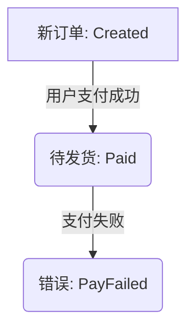

# Tangle Language Design Specification

> 文档即程序，文件即模块。

## 1. 摘要与读者定位

Tangle 是一种以 Markdown 文档作为源文件的编程语言。它把文档结构映射为语言结构：文件是模块，标题是作用域，列表是签名，代码块是执行体，表格、列表和 Mermaid 图可以被编译为规则图。

本文同时面向两类读者：

- 语言实现者：本文的规范性章节定义编译器、解释器、代码生成器和工具链必须遵守的语义。
- 早期用户：本文的解释性章节和附录示例说明如何编写、阅读和组织 Tangle 文档程序。

本文使用以下约定：

- "必须"、"不得"、"应当" 表示规范性要求。
- "可以" 表示允许但非强制的行为。
- "示例"、"说明"、"理由" 为解释性内容，不直接构成编译器约束。
- 附录中的实施路线是工程计划，不是语言语义承诺。

## 2. 用户心智模型

Tangle 的核心心智模型是：一份可读的 Markdown 文档，同时也是一个可编译的程序模块。

用户应当能用普通文档结构表达程序结构：

- 一个 `.md` 文件代表一个模块。
- 文档标题按六级分层表达组织、定义和语义细节。
- 标题下的列表描述输入参数、字段或配置。
- 标题下的文字解释设计意图和业务含义。
- `@tangle` 代码块承载可执行逻辑。
- 指令为普通 Markdown 元素附加编程语义。
- Markdown 链接既是文档超链接，也是模块导入声明。

Tangle 的目标不是让 Markdown 伪装成代码文件，而是让业务规则、说明文档和可执行逻辑共享同一份源材料。

## 3. 规范性语言定义

### 3.1 文件与模块

每个 `.md` 文件必须被视为一个独立模块。模块默认名应当由文件名派生。

一个模块可以通过 Markdown 链接导入另一个模块。链接文本为导入别名，链接目标为相对或绝对模块路径。

```markdown
## 依赖

[Math](./math_utils.md)
[Notify](./notify_service.md)
```

导入模块中的符号必须通过 `alias.symbol` 形式访问。未导出的符号不得被外部模块访问。

### 3.2 标题与作用域

Markdown 标题必须遵循 "宏观管组织，中观管定义，微观管语义" 的分层原则。

| Markdown 构件 | 分层原则 | Tangle 语义 |
| --- | --- | --- |
| `#` 一级标题 | 宏观组织 | 程序、包或文档根上下文 |
| `##` 二级标题 | 宏观组织 | 模块内分区、命名空间、依赖区或领域区 |
| `###` 三级标题 | 中观定义 | 类型定义，例如结构体、接口、错误族、枚举或和类型 |
| `####` 四级标题 | 中观定义 | 可调用定义，例如函数、方法或规则入口 |
| `#####` 五级标题 | 微观语义 | 父级定义内部的语义段，例如前置条件、步骤、分支或后置条件 |
| `######` 六级标题 | 微观语义 | 最小执行或约束单元，例如原子动作、局部断言、规则边条件或测试片段 |

标题文本是用户可读名称。标题中的括号标识符可以作为内部符号名。

```markdown
#### 发送通知 (send_notification)
```

若存在内部符号名，编译器必须使用该符号名作为稳定调用名；否则应当从标题文本生成模块内唯一符号名。

`#` 和 `##` 标题主要负责组织结构，默认不得声明可导出的运行时符号，`@entry` 除外。`###` 和 `####` 标题是符号表的主要来源，可以声明可导出的类型和可调用定义。`#####` 和 `######` 标题默认属于其最近的父级定义，不得被外部模块直接导入。

**隐式方法绑定：** 当四级标题（`####`）物理嵌套在三级标题（`###`）下方时，编译器利用 Markdown 标题树的天然父子关系，自动将四级标题识别为该三级标题所定义类型的方法。无需在标题文本中使用 `->` 箭头显式标注接收者类型。编译器通过栈式结构建立绑定，而非正则表达式解析标题文本。

### 3.3 参数、字段与返回说明

标题下方的无序列表可以定义函数参数、结构体字段或配置项。

```markdown
* `message`: 通知内容 (String)
```

反引号内名称为符号名。括号内类型标注为显式类型。省略类型标注时，编译器可以尝试推导；无法推导时必须报告编译错误。

引用块可以描述断言、返回值说明或测试说明。引用块本身不得被执行，除非被明确指令赋予测试或断言语义。

### 3.4 代码块

只有标记为 `@tangle` 的代码块可以作为执行体。

````markdown
```@tangle
return user.email
```
````

普通代码块必须被视为文档内容，不得被执行。

`@tangle` 代码块内使用 Tangle 自有语言。语法可以采用 JS-like 表面形式，但语义必须以本文定义为准。

**Lambda 表达式**使用单箭头 `->` 语法（非 `=>`）：
```@tangle
users |> filter(u -> u.is_active) |> map(u -> u.name)
```

**管道操作符** `|>` 用于优雅组织数据流，脱糖为自由函数调用：
```@tangle
let result = data |> transform(fn) |> validate(rule)
// 脱糖为：validate(transform(data, fn), rule)
```

**函数类型标注**使用 `->` 表示箭头类型：
```markdown
* `fn`: 转换函数 (T -> U)
* `combine`: 合并函数 ((T, U) -> V)
```

### 3.5 指令

指令只能出现在标题正下方，或出现在其修饰对象的正上方。指令不得夹杂在普通段落中。

| 指令 | 位置 | 语义 |
| --- | --- | --- |
| `@export` | 标题正下方 | 导出当前符号 |
| `@entry` | 标题正下方 | 标记程序入口，并隐式导出 |
| `@deprecated("reason")` | 标题正下方 | 标记弃用 |
| `@test(input=..., expect=...)` | 标题或代码块上方 | 声明测试用例 |
| `@hideCode` | 代码块上方 | 文档渲染时隐藏执行体 |
| `@error Name(...)` | 标题或代码块上方 | 声明或引用错误变体 |
| `@rule.table` | 表格上方 | 决策表规则 |
| `@rule.tree` | 列表上方 | 决策树规则 |
| `@rule.toggle` | 复选框列表上方 | 布尔配置规则 |
| `@rule.flow` | Mermaid 图上方 | 工作流规则 |

一个程序中必须只有一个 `@entry`。`@entry` 必须隐式获得 `@export` 语义。

文件级元数据应当使用 Markdown front matter 表达，例如 `version`、`title`、`author`。

## 4. 类型、对象与错误语义

### 4.1 类型系统

Tangle 使用静态类型系统。编译器必须在运行前完成类型检查。

类型系统必须支持：

- 基础类型，例如 `String`、`Int`、`Bool`。
- 值结构体。
- 和类型，例如 `Receipt | PayFailed | Timeout`。
- 泛型类型，例如 `List<T>`、`Map<K,V>`、`Option<T>`。
- 函数类型。
- 结构化接口。

类型标注可以省略，但编译器必须能推导出确定类型。若推导结果存在歧义，必须报告编译错误。

### 4.2 结构体

三级标题可以声明结构体。结构体字段由标题下方列表定义。

```markdown
### User
* `id`: 用户 ID (Int)
* `email`: 邮箱 (String)
* `is_active`: 是否激活 (Bool)
```

结构体值默认不可变。更新结构体字段必须返回新值。

**结构体初始化：** 类型名后紧跟大括号为结构体构造语法：
```@tangle
user = User { id: 1, email: "alice@tangle.io", is_active: true }
```

**不可变更新：** 实例表达式后紧跟大括号为不可变复制更新：
```@tangle
updated = user { is_active: true }
```

解析器通过向前看（Lookahead）消解二义性：大括号内紧跟 `Identifier :` 时解析为结构体构造或更新体（RecordUpdateExpression）；紧跟语句时解析为普通作用域块。

### 4.3 方法与 `this`

方法利用 Markdown 标题树的父子关系隐式绑定到其接收者类型。四级标题（`####`）物理嵌套在三级标题（`###` 结构体）下方时，编译器自动建立方法绑定。

```markdown
### User
@export
* `id`: 用户 ID (Int)
* `email`: 邮箱 (String)
* `is_active`: 是否激活 (Bool)

#### 发送通知 (send_notification)
@export
* `message`: 通知内容 (String)
```

方法在语义上是接收者为首参的自由函数。`this` 是接收者参数的语法糖。

```@tangle
if (this.is_active) {
    email_service.send(this.email, message)?
}
```

调用 `user.send_notification(message)` 必须等价于 `send_notification(user, message)`。

### 4.4 接口

接口可以用三级标题声明。

```markdown
### Notifyable (接口)

#### 发送通知 (send_notification)
* `message`: 通知内容 (String)
```

接口方法不得包含执行体。结构体只要拥有匹配签名的方法，即可满足接口。接口契合必须是结构化的，不要求显式 `implements`。

### 4.5 错误

Tangle 的可恢复错误必须通过和类型返回，不得使用异常作为普通错误控制流。

错误变体用 `@error` 声明。

```markdown
## 支付服务
@error PayFailed("支付失败", code: Int)
@error Timeout("超时")
```

函数或代码块可以用 `@error` 声明其可能返回的错误变体。

```markdown
#### 确认支付 (confirm)
@error PayFailed
@error Timeout
* `order`: 订单 (Order)
```

编译器必须拒绝返回未声明错误变体的函数。

### 4.6 错误传播与处理

`expr?` 必须表示错误传播。若表达式结果为错误变体，该错误必须从当前函数或规则子图返回。

```@tangle
receipt = confirm(order)?
```

`match` 必须对和类型进行穷举检查。

```@tangle
match confirm(order) {
    Receipt(r) => process(r)
    PayFailed(e) => log(e.code)
    Timeout => retry()
}
```

双值解构是和类型的语法糖。

```@tangle
(receipt, err) = confirm(order)
if (err != nil) {
    return err?
}
```

该语法不得改变底层返回类型。

### 4.7 Panic

`panic(message)` 表示不可恢复错误。`panic` 不得被捕获，不得用于普通业务错误。实现可以将 `panic` 映射为宿主语言的不可恢复失败机制。

## 5. 规则系统与统一 IR

### 5.1 统一原则

Tangle 必须把代码与规则统一编译为 Rule Graph。

Rule Graph 的基本构件为：

- Node：动作、计算或规则子图中的中间步骤。
- Edge：条件、跳转或控制流关系。
- Error Edge：匹配错误变体的控制流边。

每个 IR 构件必须携带源码 span，包括文件、行号和列号。源码 span 必须用于编译错误、类型错误和运行时错误回溯。

### 5.2 `@rule.flow`

`@rule.flow` 修饰 Mermaid 图。Mermaid 节点必须映射为 IR 节点或终态，Mermaid 边必须映射为 IR 边。

错误终态可以表示错误变体路由。

````markdown
### 订单状态机 (order_lifecycle)
@rule.flow


````

### 5.3 `@rule.table`

`@rule.table` 修饰表格。表格每一行必须被解释为一条决策路径。行内条件合取为路径守卫，动作列映射为目标节点或返回值。

### 5.4 `@rule.tree`

`@rule.tree` 修饰嵌套列表。默认情况下，同级列表项表示 AND 关系，子级列表项表示 OR 关系。显式关键字可以覆盖默认关系。

### 5.5 `@rule.toggle`

`@rule.toggle` 修饰复选框列表。每个复选框必须映射为布尔配置源。

```markdown
### 全局功能灰度 (get_features)
@rule.toggle

- [x] `enable_new_ui`: 启用新 UI
- [ ] `enable_crypto_payment`: 开启加密货币支付
```

### 5.6 可见性

IR 必须保留符号可见性。未 `@export` 的符号必须标记为私有。私有符号可以在模块内部被引用，不得被外部模块调用。

错误变体作为类型符号时，也必须遵守模块可见性规则。

## 6. 执行模型与工具链

### 6.1 编译流水线

Tangle 编译器应当采用以下逻辑流水线：

```text
Markdown Source
  -> Markdown AST
  -> Tangle DSL Model
  -> Unified IR / Rule Graph
  -> Execution Engine or Host Codegen
```

Markdown AST 层只负责解析通用 Markdown 结构。DSL 层负责解释指令并建立语言语义。IR 层负责统一代码、规则和错误控制流。执行层负责解释执行或生成宿主语言代码。

### 6.2 CLI

`tangle run ./main.md` 应当执行指定入口文件。

`tangle test` 应当收集并运行 `@test` 指令定义的测试。

CLI 参数应当以结构体形式注入 `@entry` 函数。

### 6.3 宿主映射

Tangle 可以通过转译模式生成宿主语言代码。宿主映射不得改变 Tangle 语义。

错误返回的推荐映射：

| 宿主 | 表示 |
| --- | --- |
| JavaScript / TypeScript | 标记对象，例如 `{ ok: true, value }` 或 `{ ok: false, error }` |
| Python | 标记对象或 tuple |
| Go | `(value, error)` |

### 6.4 标准库边界

标准库应当提供跨宿主一致的抽象，至少包含：

- `List<T>`、`Map<K,V>`、`Set<T>`
- `String`
- `Option<T>`
- `JSON`
- `HTTP`
- `IO`
- 数学函数
- `DateTime`
- `Regex`
- `Crypto`

标准库 API 必须优先保证跨宿主语义一致。

## 7. 兼容性与开放问题

以下设计作为当前规格基线：

- 文档即程序，文件即模块。
- 链接即导入。
- 代码与规则统一降为 Rule Graph。
- 结构体默认不可变，无关键字大括号更新（`user { field: val }`）。
- 方法通过标题父子层级隐式绑定（四级标题嵌套于三级标题下即为方法）。
- 方法是接收者为首参的自由函数。
- 接口采用结构化契合。
- 可恢复错误通过和类型返回。
- `@entry` 是唯一程序入口。
- IR 构件携带源码 span。
- Lambda 与函数类型标注使用单箭头 `->` 语法。
- 管道操作符 `|>` 用于数据流组合，脱糖为自由函数调用。

0.x 阶段可以调整表面语法和工具链细节，但不得随意破坏上述基线。若业务验证证明基线存在缺陷，必须通过 errata 记录原因、影响范围和替代设计。

仍需后续收紧的问题：

- 标题文本到内部符号名的默认生成规则。
- `@rule.table` 表格列名的标准格式。
- `@rule.tree` 显式 AND / OR 关键字语法。
- 泛型、和类型与结构化接口的完整推导算法。
- 标准库 API 的逐项签名。
- Source map 的序列化格式。

## 附录 A：完整示例

### A.1 结构体与方法

````markdown
### User
* `id`: 用户 ID (Int)
* `email`: 邮箱 (String)
* `is_active`: 是否激活 (Bool)

#### 激活 (activate)
@export

```@tangle
return this { is_active: true }
```
````

### A.2 错误传播

````markdown
#### 确认支付 (confirm)
@error PayFailed
@error Timeout
* `order`: 订单 (Order)

```@tangle
receipt = gateway.charge(order.amount)?
return receipt
```
````

### A.3 规则树

```markdown
#### 信用卡审批 (approve_credit_card)
@rule.tree
* `user`: 用户对象 (User)

* 核心准入条件：
    * 收入门槛：`user.income >= 10000`
    * 信用良好：`user.credit_score > 700`
* 风险对冲：
    * 资产证明：`user.has_house == true`
    * 担保人：`user.has_guarantor == true`
* 结果：返回 `true`
```

## 附录 B：术语表

| 术语 | 含义 |
| --- | --- |
| Module | 一个 `.md` 文件对应的命名空间 |
| Scope | 标题形成的语义区域 |
| Struct | 值结构体 |
| Function | 可调用函数 |
| Method | 带接收者的函数语法糖 |
| Directive | 以 `@` 开头、赋予 Markdown 元素编程语义的标记 |
| Rule Graph | Tangle 的统一中间表示 |
| Node | Rule Graph 中的计算或动作节点 |
| Edge | Rule Graph 中的控制流边 |
| Error Edge | 匹配错误变体的控制流边 |
| Source Span | 源码位置，包含文件、行、列 |
| Host | Tangle 转译或运行所依赖的目标语言或运行时 |

## 附录 C：实施路线摘要

### Track A：TypeScript 引导期

目标是在 0.x 阶段快速验证语义，仅实现 JavaScript / TypeScript codegen。

范围包括：

- Markdown 解析与指令提取。
- Tangle DSL 模型。
- `@tangle` 代码块语法子集。
- 静态类型检查与基础推导。
- Rule Graph IR。
- `@error`、`?`、`match`。
- `tangle run` 与 `tangle test`。
- JS 宿主标准库子集。
- 一个真实业务 MVP。

### Track B：Rust 权威期

目标是在语义基线稳定后，用 Rust 实现官方 `tangle-cli`。

范围包括：

- Rust 编译器骨架。
- 与 TS 版差分测试。
- Python / Go codegen。
- 跨宿主标准库一致性测试。
- 增量编译、IR 缓存、LSP 和文档生成。

### 远期：Tangle 自举

远期目标是用 Tangle 编写 Tangle 编译器。该目标不阻塞 1.0。

## 附录 D：旧草案映射

早期草案 `Tangle编程语言.md` 中的核心想法已吸收到本规格：

- "文件即模块" 对应 §3.1。
- "标题即作用域与函数" 对应 §3.2。
- "代码块即执行体" 对应 §3.4。
- "列表与引用即参数与配置" 对应 §3.3。
- 方法与接口设计对应 §4.3 和 §4.4。
- 指令集对应 §3.5。
- 混合执行体和统一 IR 方案对应 §5 与 §6.1。

若本规格与旧草案存在冲突，应以本规格为准。
