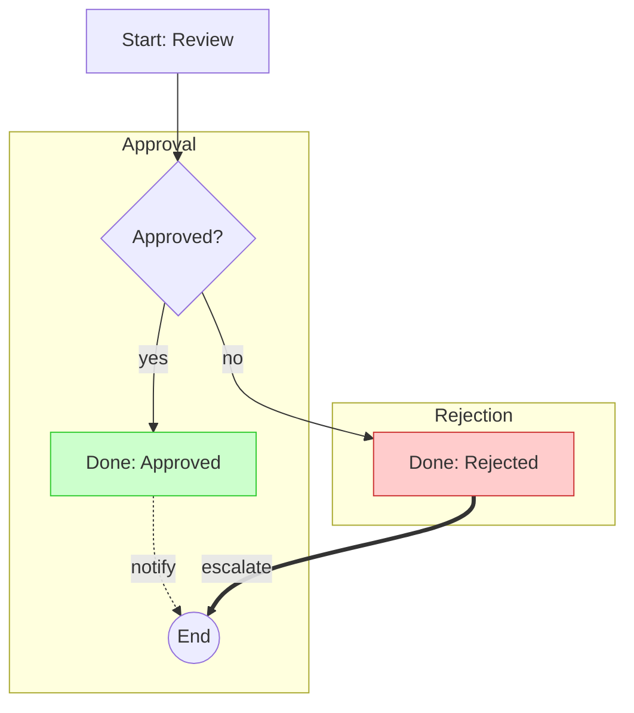

# ApprovalFlowSubgraphTest

Mermaid 流程示例：含 subgraph 分组、多边类型和样式。

##### Rule: ApprovalFlowSubgraph

```mermaid
graph TD
    A[Start: Review] --> B{Approved?}
    subgraph Approval
        B -->|yes| C[Done: Approved]
        C -.->|notify| D((End))
    end
    subgraph Rejection
        B -->|no| E[Done: Rejected]
        E ==>|escalate| D
    end
    classDef approve fill:#cfc,stroke:#3c3
    classDef reject fill:#fcc,stroke:#c33
    class C approve
    class E reject
```
